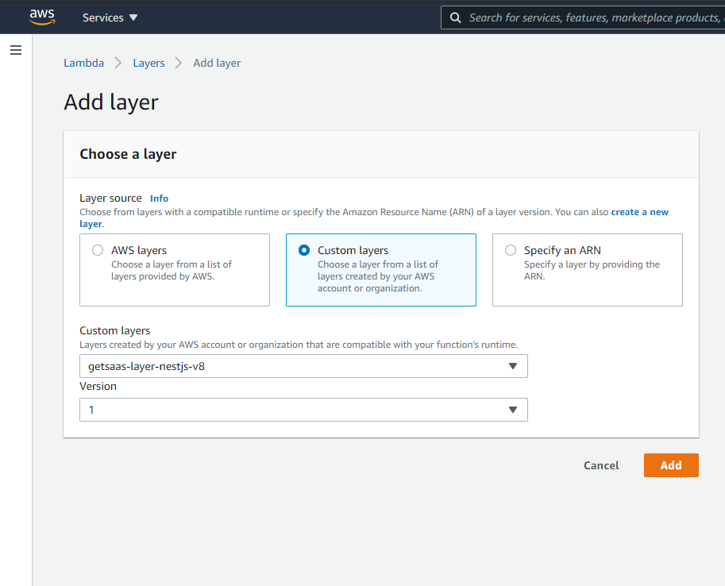

# getsaas-layer-nestjs-v8

Kitchen Sink (kinda) AWS Layer for AWS Lambda functions built on NestJS v8

## Deploying to your AWS account

Coming soon

## Batteries included

Here's the list of packages provided by this layer:

| Package | Version | Why? |
|:--- |:--- |:--- |
| `@nestjs/common` | `^8.0.4` | NestJS Core Dependencies |
| `@nestjs/core` | `^8.0.4` | NestJS Core Dependencies |
| `@nestjs/bull` | `^0.4.0` | [Redis-based External Queues] |
| `bull` | `^3.3` | [Redis-based External Queues] |
| `@nestjs/config` | `^1.0.1` | [Configuration] |
| `@nestjs/cqrs` | `^8.0.0` | [Command Query Responsibility Segregation] |
| `@nestjs/elasticsearch` | `^8.0.0` | [Elasticsearch Integration] |
| `@elastic/elasticsearch` | `^7.4.0` | [Elasticsearch Integration] |
| `@nestjs/event-emitter` | `^1.0.0` | [In-App Event Emitter] |
| `eventemitter2` | `=6.4.4` | [In-App Event Emitter] |
| `@nestjs/graphql` | `^8.0.2` | [GraphQL APIs] |
| `@apollo/federation` | `^0.26.0` | [GraphQL APIs] |
| `@apollo/gateway` | `^0.33.0` | [GraphQL APIs] |
| `apollo-server-core` | `=2.21.1` | [GraphQL APIs] |
| `graphql` | `^14.5.0` | [GraphQL APIs] |
| `@nestjs/passport` | `^8.0.0` | [Passport-based Auth] |
| `passport` | `^0.4.0 ` | [Passport-based Auth] |
| `@nestjs/jwt` | `^8.0.0` | [Passport-based Auth] |
| `@nestjs/platform-express` | `^8.0.4` | [Express on AWS Lambda] |
| `@vendia/serverless-express` | `^4.3.9` | [Express on AWS Lambda] |
| `express` | `^4.17.1` | [Express on AWS Lambda] |
| `@nestjs/serve-static` | `^2.2.2` | [Static File Serving] |
| `@nestjs/swagger` | `^5.0.8` | [REST APIs] |
| `swagger-ui-express` | `^4.1.6` | [REST APIs] |
| `@nestjs/throttler` | `^2.0.0` | [Request Rate Limiting] |
| `@nestjs/mongoose` | `^8.0.0` | [MongoDB Support] |
| `mongoose` | `^5.12.4 ` | [MongoDB Support] |
| `cache-manager` | `^3.4.4` | Other NestJS Dependencies |
| `class-transformer` | `^0.4.0` | Other NestJS Dependencies |
| `class-validator` | `^0.13.1` | Other NestJS Dependencies |
| `@nestjs/mapped-types` | `^1.0.0` | Other NestJS Dependencies |
| `reflect-metadata` | `^0.1.13` | Other NestJS Dependencies |
| `rxjs` | `^7.2.0` | Other NestJS Dependencies |

## Usage

### As a NodeJS dependency in your project

In your project directory:

`yarn add @getsaas/layer-nestjs-v8`

or 

`npm i -S @getsaas/layer-nestjs-v8`

Now when you build and deploy your lambda function, the `node_modules` directory will include all dependencies in the layer.

### As an AWS Lambda layer

In your project directory:

`yarn add -D @getsaas/layer-nestjs-v8`

or 

`npm i -D @getsaas/layer-nestjs-v8`

When you build your lambda function for deployment, make sure to only install `production` dependencies. Then:

1. Go to the details page for your AWS Lambda Function,
2. Click on Layers and then on `Add a layer`,
3. Select `Custom layers (Choose a layer from a list of layers created by your AWS account or organization.)` as the Layer source,
4. From the `Custom layers` dropdown list, select `getsaas-layer-nestjs-v8` and select the appropriate layer version:

[Redis-based External Queues]: https://docs.nestjs.com/techniques/queues
[Elasticsearch Integration]: https://github.com/nestjs/elasticsearch
[Configuration]: https://docs.nestjs.com/techniques/configuration
[Command Query Responsibility Segregation]: https://docs.nestjs.com/recipes/cqrs
[GraphQL APIs]: https://docs.nestjs.com/graphql/quick-start
[REST APIs]: https://docs.nestjs.com/openapi/introduction
[Static File Serving]: https://docs.nestjs.com/recipes/serve-static
[Passport-based Auth]: https://docs.nestjs.com/security/authentication
[Request Rate Limiting]: https://docs.nestjs.com/security/rate-limiting
[MongoDB Support]: https://docs.nestjs.com/recipes/mongodb
[In-App Event Emitter]: https://docs.nestjs.com/techniques/events
[Express on AWS Lambda]: https://www.npmjs.com/package/@vendia/serverless-express